# Lab 01 - Create a virtual machine in the portal

## Lab Overview

An Azure Virtual Machine (VM) is a computing resource provided by Microsoft Azure. It allows users to create and use virtualized computing instances in the cloud. Azure Virtual Machines enable users to run applications, host websites, and perform various computing tasks without needing to purchase and maintain physical hardware.

In this walkthrough, we will create a virtual machine in the Azure portal, connect to the virtual machine, install the web server role and test.

## Lab Objectives

In this lab, you will complete the following tasks:

+ Task 1: Create the virtual machine
+ Task 2: Connect to the virtual machine
+ Task 3: Host a Basic Website on your New Cloud VM

## Estimated timing: 30 minutes

## Architecture diagram

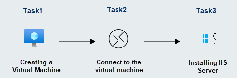 

**Note**: Take time during this walk-through to click and read the Informational icons.

### Task 1: Create the virtual machine

In this task, we will create a Windows Server 2019 Datacenter - Gen2 virtual machine. 

1. On Azure Portal page, in **Search resources, services, and docs (G+/) box** at the top of the portal, enter **Virtual machines (1)**, and then select **Virtual machines (2)** under services.

    

1. On the **Virtual machines** blade, click **+ Create (1)** and choose **Azure virtual machine (2)**.

     

1. On the **Basics** tab, fill in the following information (leave the defaults for everything else):

    | Settings | Values |
    |  -- | -- |
    | Subscription | **Accept default subscription** (1)|
    | Resource group | **myRGVM-<inject key="DeploymentID" enableCopy="false"/>** (2) |
    | Virtual machine name | **myVm** (3)|
    | Location | **<inject key="Region" enableCopy="false"/>** (4)|
    | Image | **Windows Server 2019 Datacenter - x64 Gen2** (5)|

     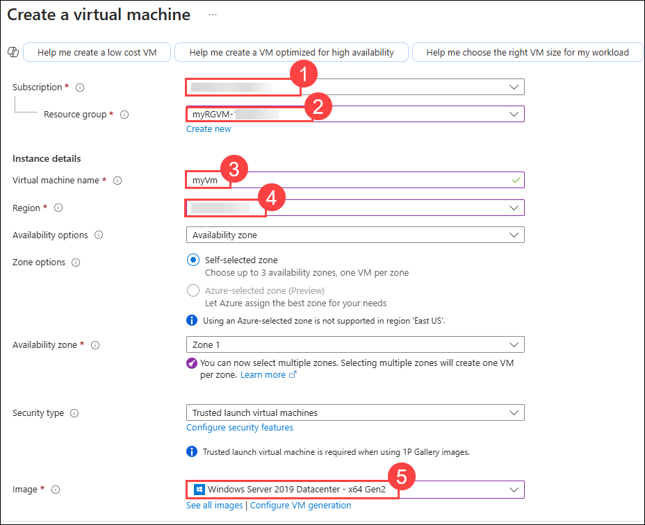

    | Settings | Values |
    |  -- | -- |     
    | Size | **Standard_D2s_v3** (6)|
    | Administrator account username | **azureuser** (7)|
    | Administrator account password | **Pa$$w0rd1234** (8)|
    | Administrator account Confirm password | **Pa$$w0rd1234** (9)|
    | Public Inbound ports  | **Allow select ports** (10)|
    | Select inbound ports | **RDP (3389)** and **HTTP (80)** (11)|
    |||

    - Click on **Next:Disks >** (12).

      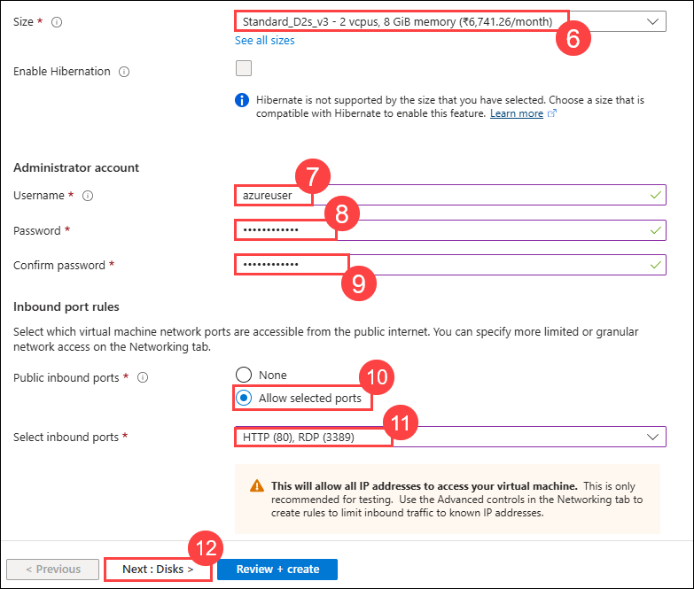

1. On the **Disks** tab and in the **OS Disk type** select **Standard HDD (1)** from the dropdown and leave everything else as default and click **Next : Networking > (2)**. 

   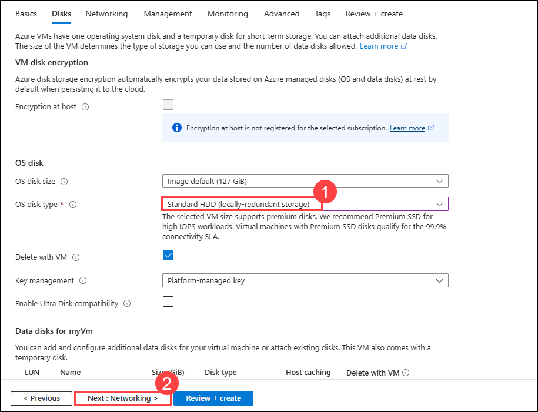

1. Within the Networking tab, look for the **Select inbound ports** provide the below Values **(1)** and then click **Next : Management > (2)**.

    | Settings | Values |
    | -- | -- |
    | Select inbound ports | **HTTP (80), RDP (3389)**|

     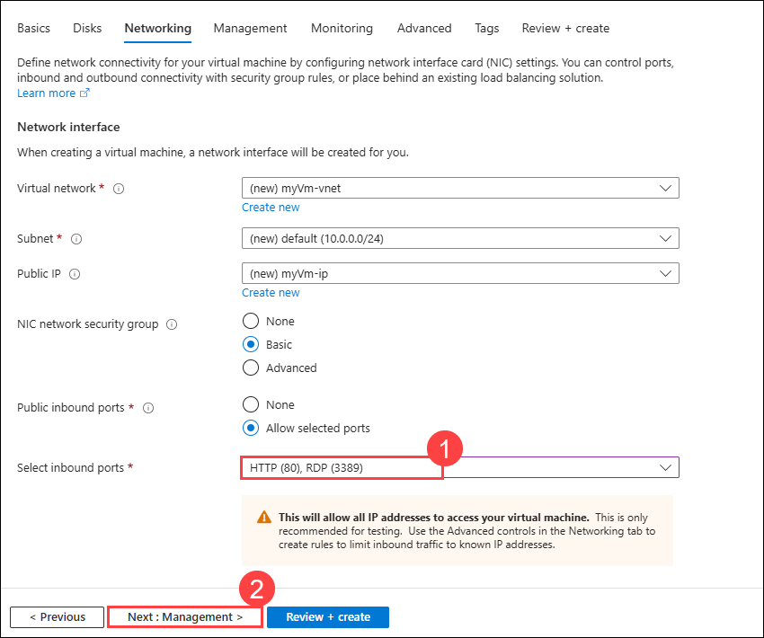    
   
      >**Note:** - Verify that both port 80 and 3389 are selected.

1. On the **Management** tab and leave everything as default.

1. Click **Next : Monitoring >** to switch to the **Monitoring** tab, select the following setting **(1)**. Leave the remaining defaults and then click the **Review + Create (2)** button at the bottom of the page.

    | Settings | Values |
    | -- | -- |
    | Boot diagnostics | **Disable**|

    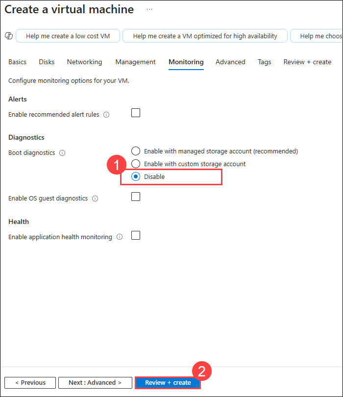      
  
1. Once **Validation** is passed click the **Create** button. It can take anywhere from five to seven minutes to deploy the virtual machine.

1. You will receive updates on the deployment page and via the **Notifications** area (the bell icon in the top menu).

   >**Note**: Here is the reference link for virtual machine https://azure.microsoft.com/en-in/resources/cloud-computing-dictionary/what-is-a-virtual-machine/.

### Task 2: Connect to the virtual machine

In this task, we will connect to our new virtual machine using RDP. 

1. Once the deployment is complete, click on **Go to resource** you will be directed to the page of the newly created Virtual Machine.

    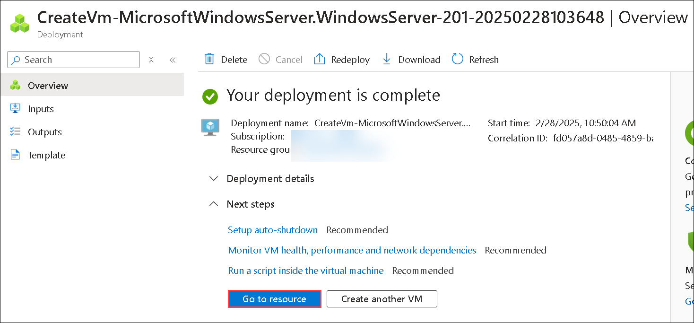
   
1. On the virtual machine **Overview** blade, click the **Connect (1)** button and choose the **Connect (2)** from the dropdown.

    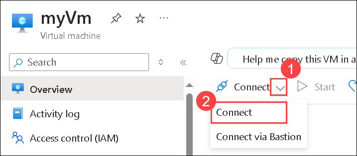

    >**Note:** The following directions tell you how to connect to your VM from a Windows computer. On a Mac, you need an RDP client such as this Remote Desktop Client from the Mac App Store and on a Linux computer you can use an open source RDP client.

1. Within the **Connect** page, click on **Download RDP File**.

   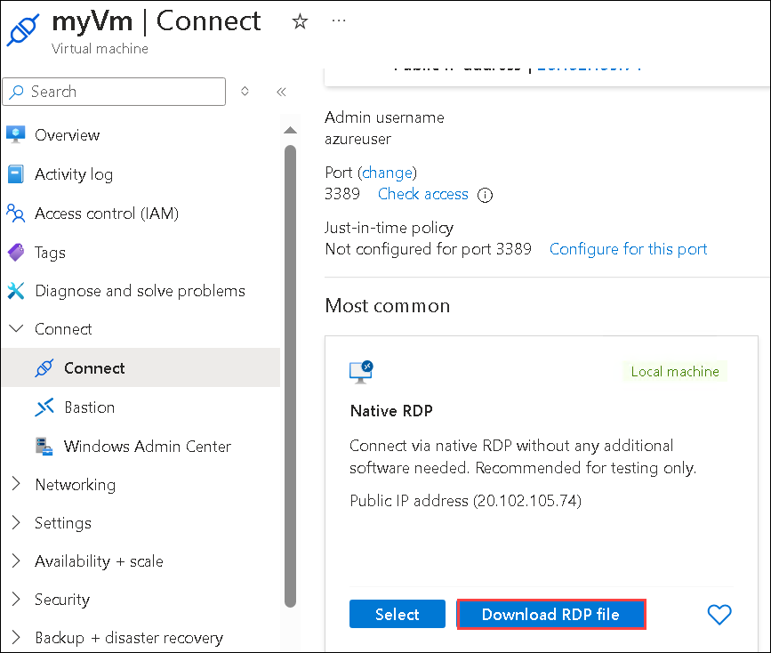

1. Once the file is downloaded,you will be directed with a warning, click on **Keep**.

1. **Open** the downloaded RDP file.

   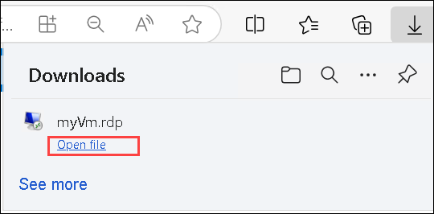

1. Click **Connect** when prompted. 

    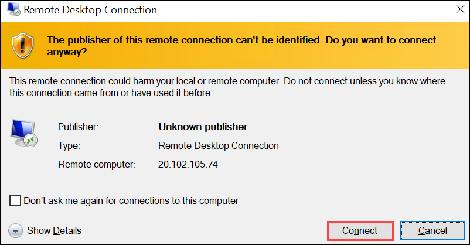

1. In the **Windows Security** window, select **More choices**.

   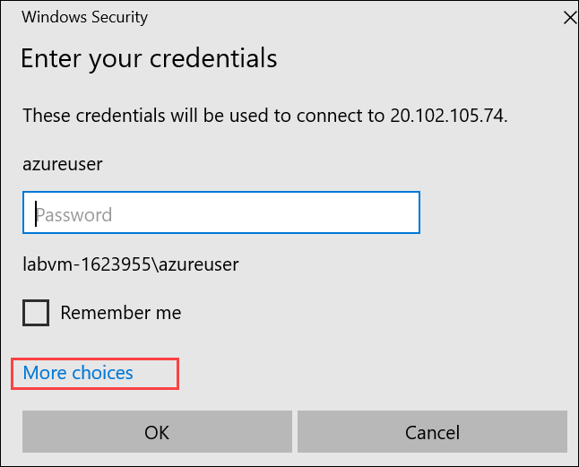

1. Then **Use a different account**.

   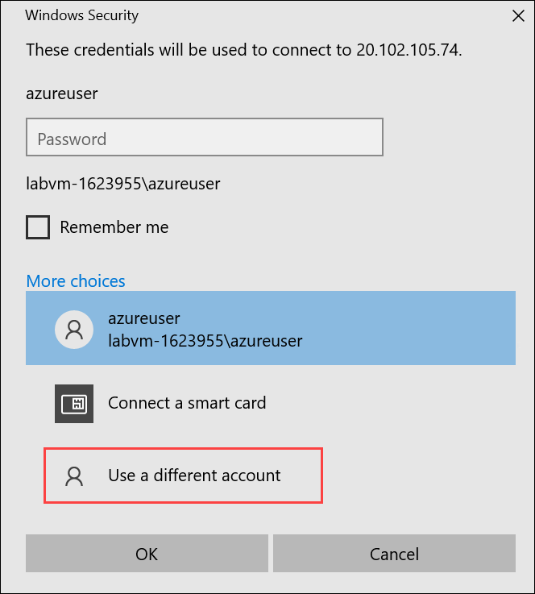

1. Provide the following credentials and then click on **OK (3)** to connect.

    - username: `.\azureuser` **(1)**
    - Password: `Pa$$w0rd1234` **(2)**

      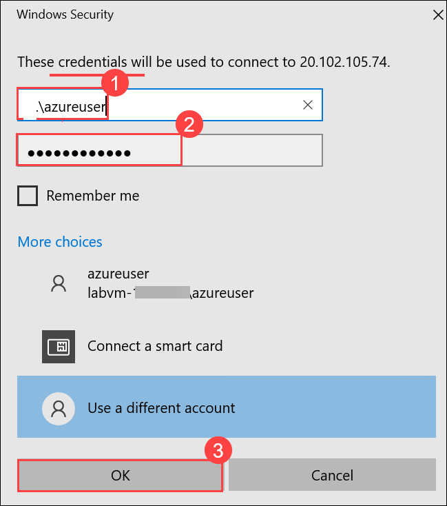

1. You may receive a certificate warning during the sign-in process. Click **Yes** or to create the connection and connect to your deployed VM. You should connect successfully.

    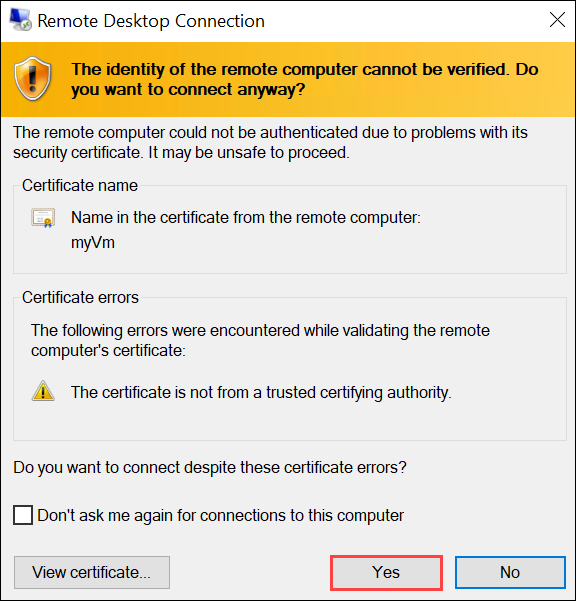

### Task 3: Host a Basic Website on your New Azure Cloud VM

In this task, install the Web Server role on the server and host a basic website.

1. In the **Server Manager** (which should launch automatically) once you connect to the vm, select **Add roles and features** as shown below in the screenshot.

    

    >**Note:** If you get a pop-up related to **Networking** click **No**. If you get a tab **Server Manager**, close the tab.
    
    

1. In the **Add Roles and Features Wizard** dialog box, on the **Before You Begin** page, click **Next** to continue.

    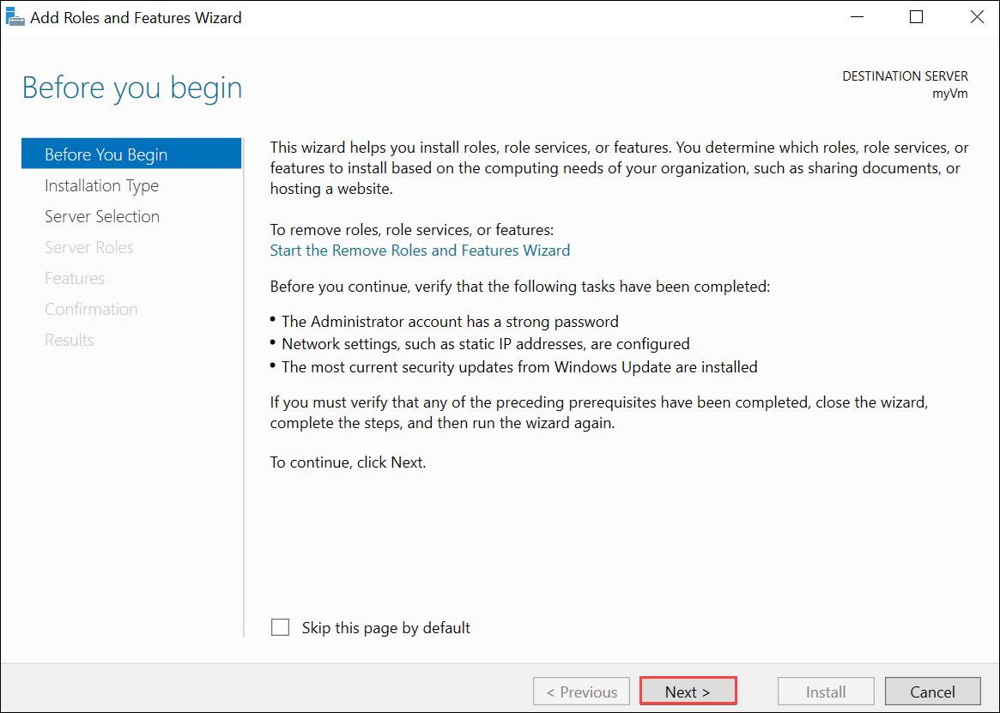

1. Ensure **Role-based or feature-based installation (1)** is selected in **Select installation type** page and  Click **Next (2)**.

    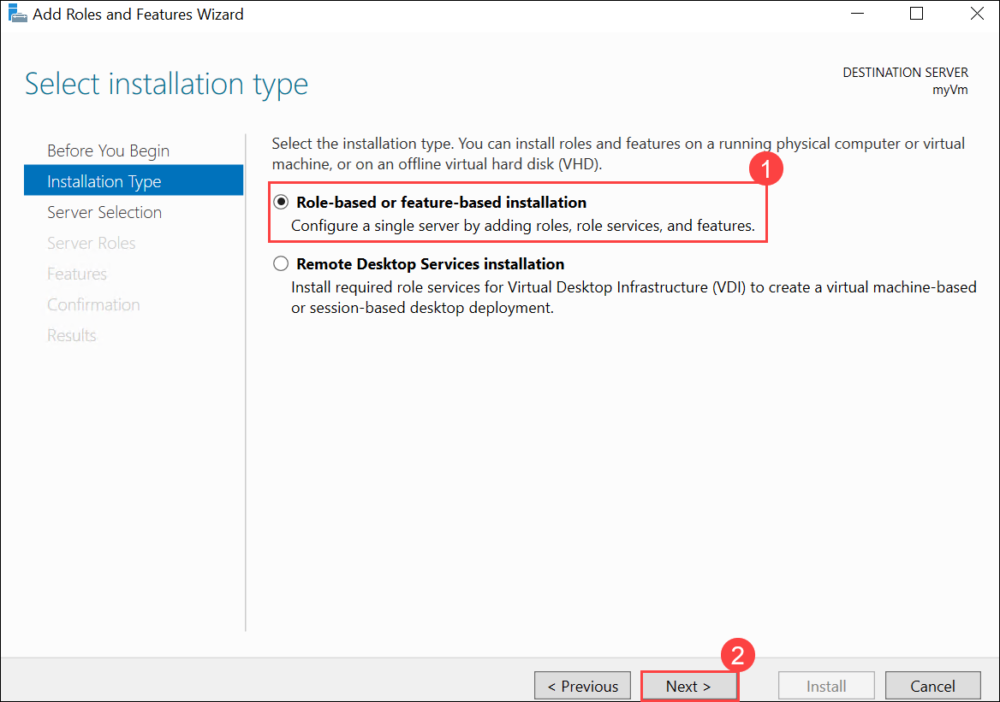

1. Ensure **Select a server from the server pool (1)** is selected in **Select destianation server** page, and that your VM appears in the list below. Click on **Next (2)**.

    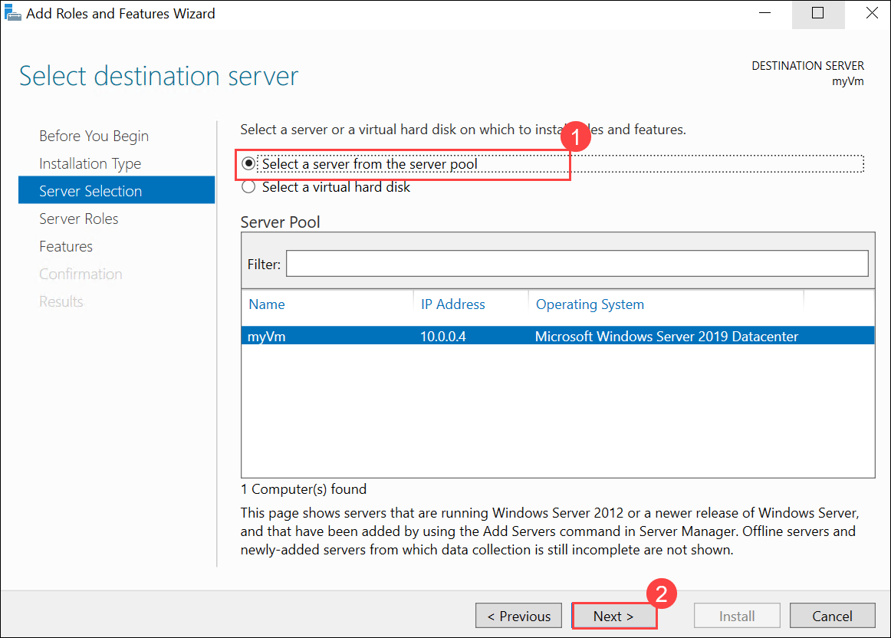

1. On the **Select Server Roles** page, scroll down the list and check **Web Server (IIS)**. Then click **Add Features**.

    

    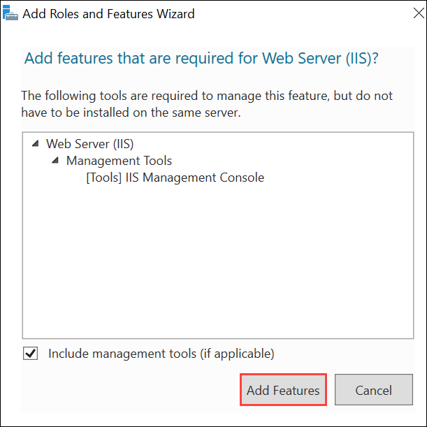    

1. Click on **Next** until you reach the **Confirm installation selections** page and make sure **Restart the destination server automatically if required (1)** is checked. Then click on **Install (2)**.

    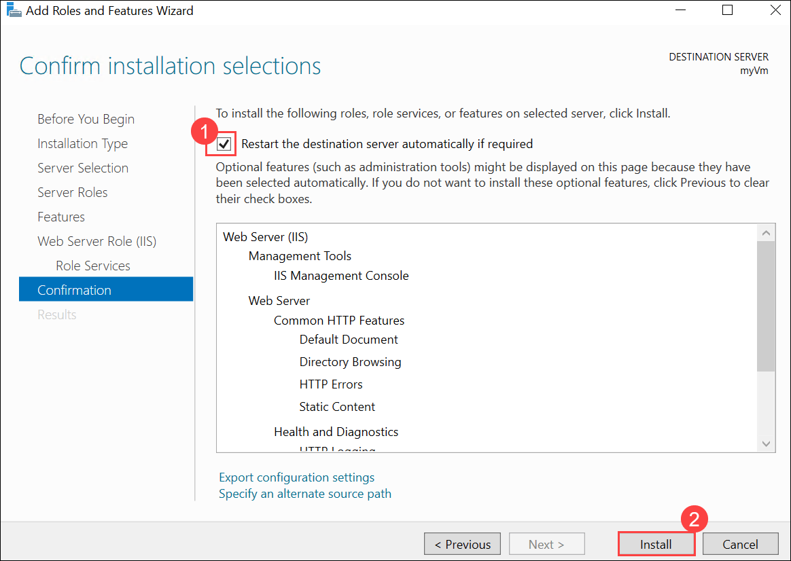

    >**Note:** If a pop-up appears warning about the automatic server restart, select **Yes**.

1. When the installation completes **(1)**, click on **Close (2)** and back on the server manager portal.

    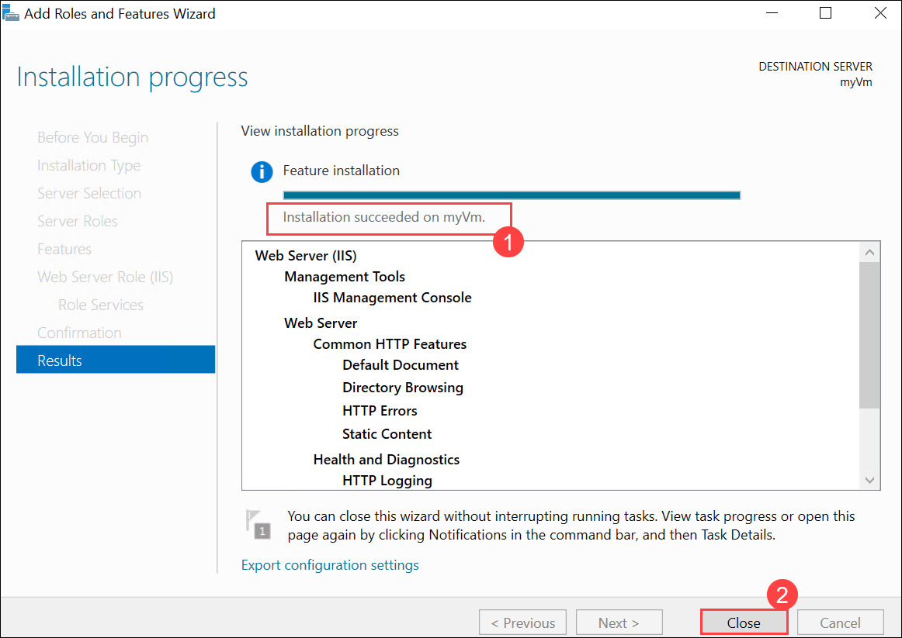

1. Go to **Tools (1)** > **Internet Information Services (IIS) Manager (2)**.
    
    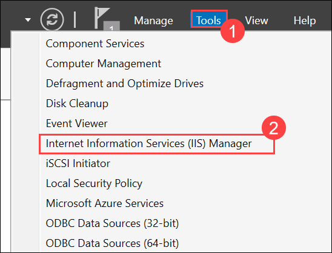    

1. In the **Internet Information Services (IIS) Manager** window, locate your server’s **Default Web Site** in the connections tree and then click on it.

    

1. Now, click on **Basic Settings** in the **Actions** menu.

    

1. In the new pop-up dialog box, locate the **Physical Path (1)** and click **OK (2)**. This is where you'll put your website html file.    

    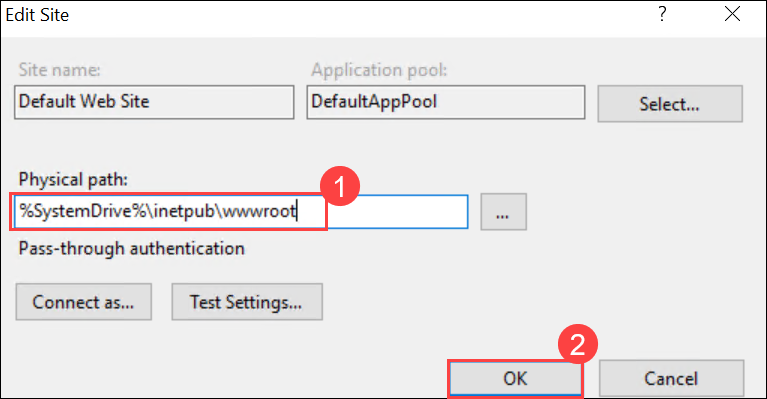

   >**Note:** Keep a note of the path as it will be required in the preceding steps.

1. Navigate to `C:\inetpub\wwwroot` in the **File explorer**, which is specified in the Basic Settings. 

    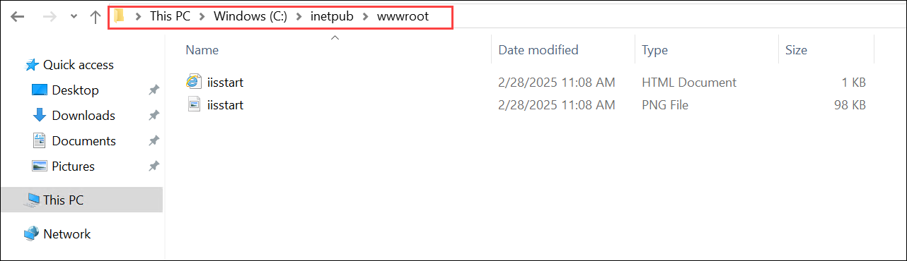

1. Copy the already presented **iisstart.html** file then paste into the into this folder.

1. Right click on **iisstart-Copy (1)** and then **Rename (2)** it to  **Default**.

    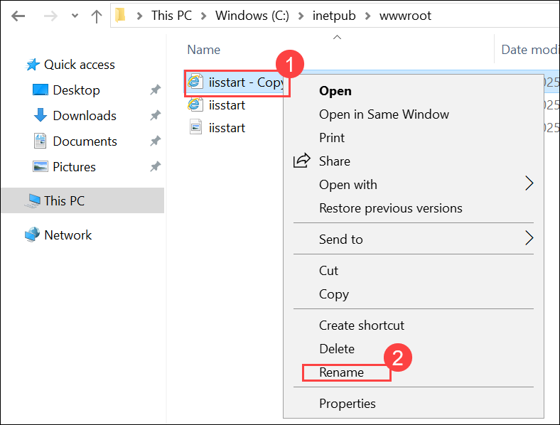

    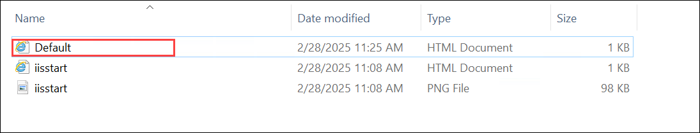    

1. Right-click on **Default.html (1)**, choose **Open with (2) > Notepad (3)**.

    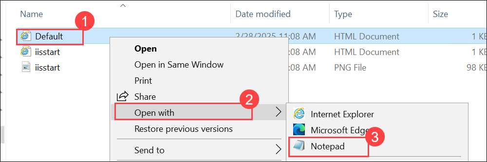 

1. Replace the existing code with the below provided code, and then save the file.

    >**Note:** If you have trouble copying **iisstart.html**, select the iisstart.html and use **Ctrl + C** to copy and **Ctrl + V** to paste it.

    >**Note:** Please make sure VM Native Clipboard is enabled if copy-paste is not working.
    >    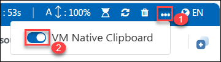

    ```
    <html>
    <body>
        <h1>Demo Website</h1>
        <p>This is my first cloud hosted website.</p>
    </body>
    </html>
    ```
    

1. Now back in the **Azure portal**, navigate back to the **Overview** blade of myVM and use the Copy to clipboard button to copy the **public IP address** of myVm.

    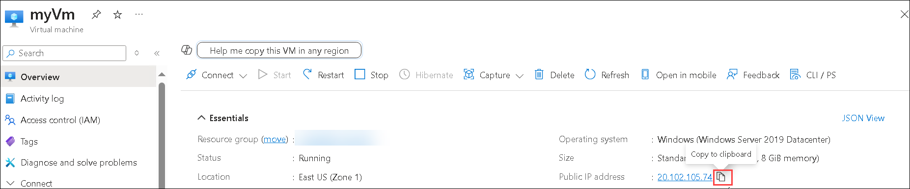 

1. Open a new browser tab, paste the public IP address into the URL text box, and press the Enter key to browse to it. The custom created basic website shows up.

    

<validation step="5b0e6dcc-0bdc-40a8-8012-226e432663c5" />

> **Congratulations** on completing the task! Now, it's time to validate it. Here are the steps:
> - Hit the Validate button for the corresponding task. If you receive a success message, you have successfully completed the task. 
> - If not, carefully read the error message and retry the step, following the instructions in the lab guide.
> - If you need any assistance, please contact us at labs-support@spektrasystems.com. We are available 24/7 to help
    
### Review

In this lab, you have completed:
- Created the virtual machine
- Connected to the virtual machine
- Hosted a Basic Website on your New Cloud VM

## Reference links

- https://azure.microsoft.com/en-in/resources/cloud-computing-dictionary/what-is-a-virtual-machine/

- https://learn.microsoft.com/en-us/partner-center/marketplace/azure-vm-use-approved-base

## You have successfully completed this lab.
