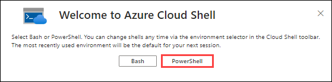
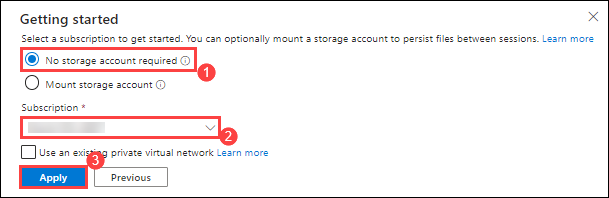
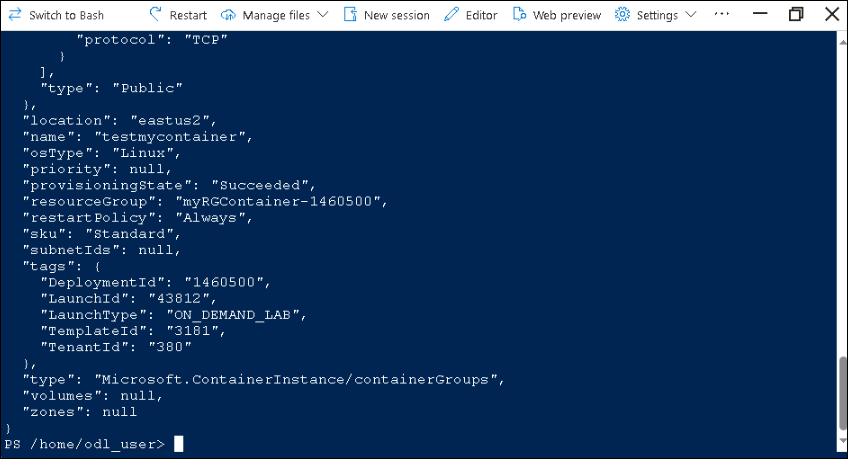
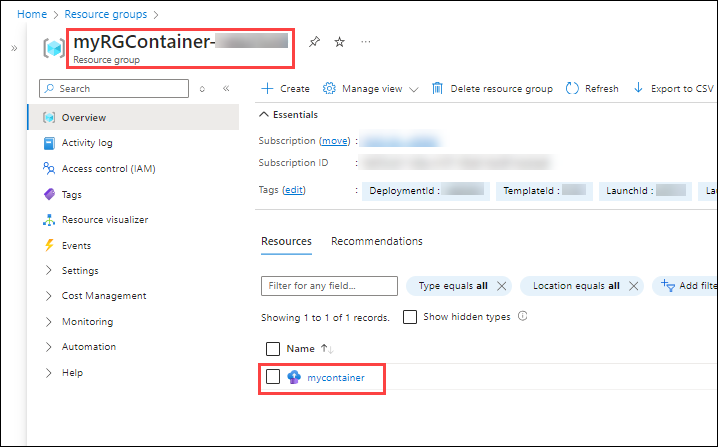

# Lab 03 - Deploy Azure Container Instances

## Lab overview

Azure Container Instances enables exposing your container groups directly to the internet with an IP address and a fully qualified domain name (FQDN). When you create a container instance, you can specify a custom DNS name label so your application is reachable. Azure Container Instances offers the fastest and simplest way to run a container in Azure, without having to manage any virtual machines and without having to adopt a higher-level service.

In this walkthrough, we create, configure, and deploy a Docker container by using Azure Container Instances (ACI) in the Azure Portal. The container is a Welcome to ACI web application that displays a static HTML page.

## Lab objectives

In this lab, you will complete the following tasks:

+ Task 1: Create a container instance
+ Task 2: Verify deployment of the container instance

## Estimated timing: 15 minutes

## Architecture diagram

 

### Task 1: Create a container instance

In this task, we will create a new container instance for the web application.

1. From the Azure portal, open the **Azure Cloud Shell** by clicking on the icon in the top right of the Azure Portal.

    

1. The first time you open the Cloud Shell, you may be prompted to choose the type of shell you want to use (*Bash* or *PowerShell*). If so, select **Powershell**.

    
   
1. On the Getting started, select **No storage account required (1)** and select your **Subscription (2)** under storage account subscription. Click on **Apply (3)**.

    

1. In the upper-left menu of the Cloud Shell pane, make sure you are using **Powershell**. If not selected select **Switch to Powershell**. In **Switch to Powershell in Cloud Shell** pop-up select **Confirm**.

1. In the Powershell session, within the Cloud Shell pane, run the following command. 

    ```cli
    az container create --resource-group myRGContainer-<inject key="DeploymentID" enableCopy="false" /> --name mycontainer --image mcr.microsoft.com/azuredocs/aci-helloworld --cpu 1 --memory 1.5 --dns-name-label mycontainerdns<inject key="DeploymentID" enableCopy="false" /> --ports 80
    ```

1. While you wait you may be interested in viewing the [sample code behind this simple application](https://github.com/Azure-Samples/aci-helloworld). Browse the \app folder.

1. You will see the resource created in the powershell window.

    

### Task 2: Verify deployment of the container instance

In this task, we verify that the container instance is running by ensuring that the welcome page displays.

1. After the deployment is complete, navigate to **myRGContainer-<inject key="DeploymentID" enableCopy="false" />** resource group and select **mycontainer** container instance.

   

1. On the **Overview** blade of **mycontainer**, ensure your container **Status** is **Running**.

    

1. Locate and copy the **Fully Qualified Domain Name (FQDN)**.

    

1. Paste the container's FQDN into the new browser tab and press **Enter**. The Welcome page should display.

   >**Note**: It might take 3 - 5 minutes to load the page.
 
   
	
   >**Note**: You could also use the container IP address in your browser.

<validation step="f87beab3-3bb6-467e-839f-c821f172a4b8" />
   
> **Congratulations** on completing the task! Now, it's time to validate it. Here are the steps:
> - Hit the Validate button for the corresponding task. If you receive a success message, you can proceed to the next task. 
> - If not, carefully read the error message and retry the step, following the instructions in the lab guide.
> - If you need any assistance, please contact us at labs-support@spektrasystems.com. We are available 24/7 to help
    
### Review
In this lab, you have completed:
- Created a container instance
- Verified deployment of the container instance

## Reference links

- https://learn.microsoft.com/en-us/azure/container-instances/container-instances-overview

- https://learn.microsoft.com/en-us/azure/container-instances/container-instances-quickstart-portal
  
## You have successfully completed this lab.

