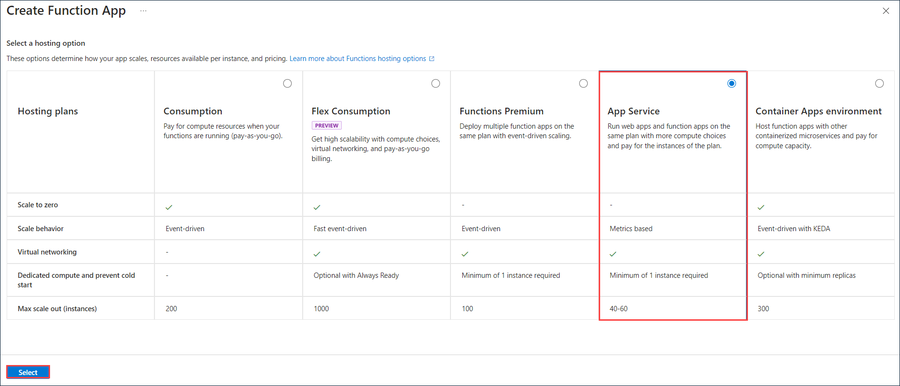
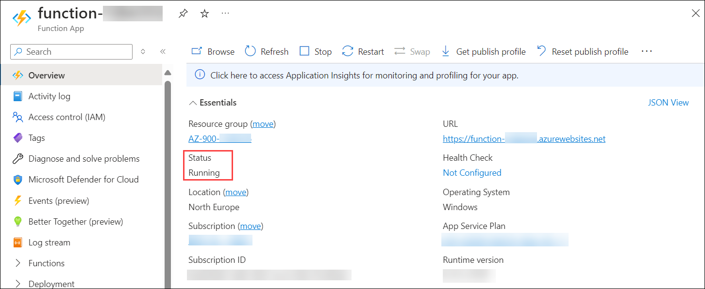
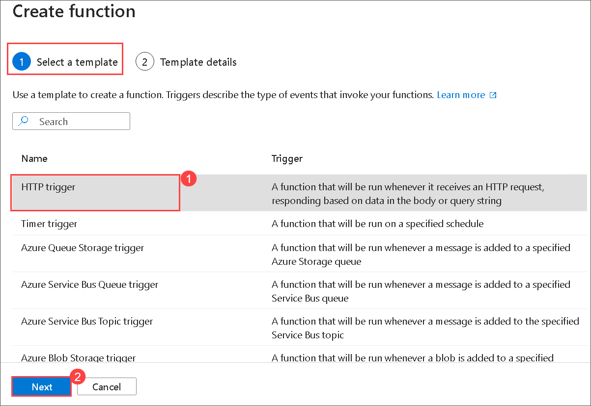
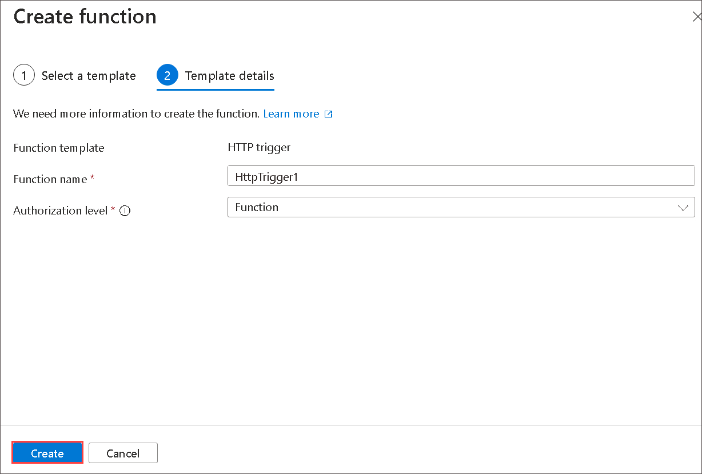
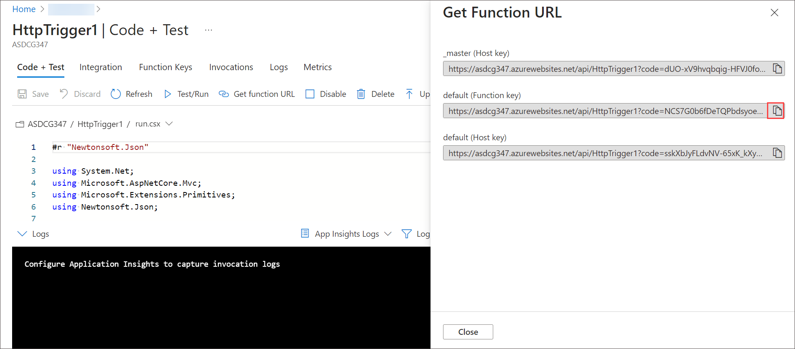

# Lab 08 - Implement Azure Functions

## Lab overview

Azure Functions is a serverless solution that allows you to write less code, maintain less infrastructure, and save on costs. Instead of worrying about deploying and maintaining servers, the cloud infrastructure provides all the up-to-date resources needed to keep your applications running.

In this walkthrough, we will create a Function App to display a Hello message when there is an HTTP request.

## Lab objectives

In this lab, you will complete the following tasks:

+ Task 1: Create a Function app
+ Task 2: Create a HTTP triggered function and test

## Estimated timing: 15 minutes

## Architecture diagram

 

### Task 1: Create a Function app

In this task, we will create a Function app.

1. On Azure Portal page, in **Search resources, services and docs (G+/)** box at the top of the portal, enter **Function App (1)**, and then select **Function App (2)** under services.

    
      
1. On the **Function App** blade, click **+ Create**. Choose Hosting plan as **App service** then click on **Select**.

   

1. On the **Basic** tab of the **Function App** blade, specify the following settings and leave all others with their default values: 

    | Settings | Value |
    | -- | --|
    | Subscription | select existing Azure subscription |
    | Resource group | select **existing** resource group **myRGFunction-<inject key="DeploymentID" enableCopy="false"/>** |
    | Function App name | **function-<inject key="DeploymentID" enableCopy="false"/>**|
    | Publish | **Code**|
    | Runtime stack | **.NET** |
    | Version | **8 (LTS), in-process model** |
    | Region | **<inject key="Region" enableCopy="false"/>**|
    | Operating System  | **Windows**|
    | Pricing plan | Select **Basic B1** | 
        
1. Click **Review + create** and, after successful validation, click **Create** to begin provisioning and deploying your new Azure Function App.

1. Wait for the notification that the resource has been created, select **Go to resource**.

1. On the **function-<inject key="DeploymentID" enableCopy="false"/>** blade, verify that the function app has the **Running** status.  

    

# Task 2: Create a HTTP triggered function and test

In this task, we will use the Webhook + API function to display a message when there is an HTTP request. 

1. On the overview blade, in the **Functions (1)** section, click **Create function (2)**.

    

1. On the **Select a Templates** tab of the **Create Function** blade, click **HTTP trigger (1)**. Click **Next (2)**  

    

1. On **Template details** tab accept default values and click on **Create**.

   

1. On the **HttpTrigger1 \| Code + Test** blade, review the auto-generated code and note that the code is designed to run an HTTP request and log information. Also, notice the function returns a Hello message with a name. 

1. Click **Get function URL** from the top section of function editor. 

1. Ensure to copy the value in the **default (function key)** URL. 

   
   
1. Open a new browser tab and paste the copied function URL into your web browser's address bar. When the page is requested the function will run. Notice the returned message stating that the function requires a name in the request body.

    
   
1. Append **&name=yourname** to the end of the URL.

    **Note**: Replace ***yourname*** with your first name. For example, if your name is Cindy, the final URL will resemble the following `https://azfuncxxx.azurewebsites.net/api/HttpTrigger1?code=X9xx9999xXXXXX9x9xxxXX&name=Cindy`

     
   
<validation step="aa3ef50a-af7a-4070-b8a1-75c0a741eb60" />

> **Congratulations** on completing the task! Now, it's time to validate it. Here are the steps:
> - Hit the Validate button for the corresponding task. If you receive a success message, you can proceed to the next task. 
> - If not, carefully read the error message and retry the step, following the instructions in the lab guide.
> - If you need any assistance, please contact us at labs-support@spektrasystems.com. We are available 24/7 to help

### Review
In this lab, you have completed:
- Created a Function app
- Created a HTTP triggered function and test

## Reference link

- https://learn.microsoft.com/en-us/azure/azure-functions/functions-overview?pivots=programming-language-csharp
  
## You have successfully completed this lab.
