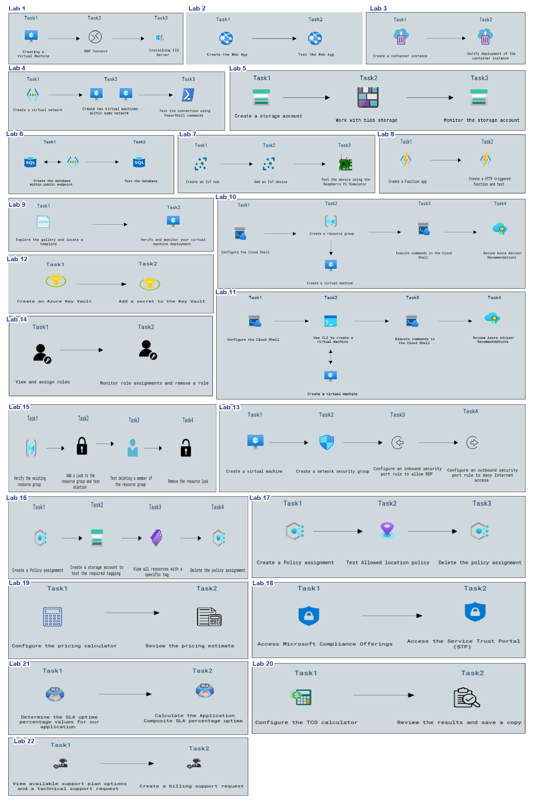

# AZ-900: Microsoft Azure Fundamentals

## Overview
 
The AZ-900: Microsoft Azure Fundamentals lab is an introductory, hands-on workshop designed to provide participants with a foundational understanding of Azure cloud services. In this lab, attendees will explore core Azure concepts, including cloud computing principles, Azure architecture, and essential services like compute, storage, and networking. The lab covers various Azure solutions, such as virtual machines, Azure Blob Storage, and virtual networks, while demonstrating their use in real-world scenarios. Participants will also learn about Azure security features, cost management, and governance tools, gaining insight into Azure’s compliance standards. By the end of the lab, participants will have practical knowledge of the essential components of Azure and the confidence to support cloud-based decision-making and infrastructure in an enterprise environment.

## Objective

The objective of the AZ-900: Microsoft Azure Fundamentals lab is to provide participants with a foundational understanding of cloud concepts and Microsoft Azure services. By the end of the workshop, attendees will have practical experience in using key Azure services, including virtual machines, storage, networking, and databases, while gaining insights into Azure’s pricing, governance, and security features. This hands-on experience is designed to empower participants to leverage Azure for building, managing, and deploying cloud applications and services, enabling them to make informed decisions and drive innovation within their organizations.

- **Create a virtual machine in the portal:** Enable users to efficiently create and connect to virtual machines in the cloud, streamlining the setup of web hosting environments. Empower teams to host and manage basic websites with ease, directly on their new cloud VM.

- **Create a Web App:** Guide users to create and test a cloud-based web app, ensuring they can deploy and verify its functionality. This equips them with core skills in cloud-based web deployment and testing.

- **Deploy Azure Container Instances:** Enable users to create and verify a container instance deployment in the cloud, providing foundational skills in containerized application setup and deployment validation.

- **Create blob storage:** Enable users to create and manage cloud storage accounts, simplifying data storage and access. Empower teams to work with blob storage and monitor account performance for optimal data management and security.

- **Create a SQL database:** Enable users to efficiently create and configure databases, streamlining data storage and management. Empower teams to test database functionality, ensuring proper setup and performance for reliable data operations.

- **Implement an Azure IoT Hub:** Allow users to set up and configure an IoT hub, ensuring smooth device connectivity. Enable teams to add IoT devices and test their performance using the Raspberry Pi Simulator for effective real-time device management and troubleshooting.

- **Implement Azure Functions:** Empower users to create and configure a Function app for serverless computing, allowing teams to develop and test HTTP-triggered functions for optimal execution and responsive handling.

- **Create a VM with a Template:** Allow users to explore the template gallery and find the relevant deployment templates. Enable teams to verify and monitor virtual machine deployments, ensuring successful provisioning and peak performance.

- **Create a VM with PowerShell:** Allow users to set up Cloud Shell and create virtual machines for efficient cloud management. Enable teams to run commands and access Azure Advisor recommendations to optimize resource performance and management.
 
- **Create a VM with the CLI:** Enable users to configure Cloud Shell and use the CLI for creating virtual machines, simplifying cloud resource management. Empower teams to execute commands and access Azure Advisor recommendations to enhance efficiency and follow best practices.

- **Implement Azure Key Vault:** Allow users to create an Azure Key Vault for securely storing sensitive information. Enable teams to add and manage secrets within the Key Vault, ensuring both data security and easy accessibility.

- **Secure network traffic:** Allow users to create virtual machines and configure network security groups for controlled access. Enable teams to define inbound RDP rules and outbound security rules to manage network traffic and limit internet access.

- **Manage access with RBAC:** Enable users to view and assign roles, streamlining access management. Empower teams to monitor role assignments and efficiently remove roles to maintain security and compliance.

- **Manage resource locks:** Allow users to verify and manage resource groups, ensuring they are properly protected and controlled. Enable teams to add resource locks, test deletion actions, and remove locks as needed, striking a balance between safeguarding resources and maintaining operational flexibility.

- **Implement resource tagging:** Empower users to create policy assignments for enforcing compliance and managing resource tagging. Provide teams with the ability to create storage accounts, view tagged resources, and delete policy assignments to ensure governance while maintaining flexibility.

- **Create an Azure Policy:** Enable users to create policy assignments to enforce governance rules. Empower teams to test the Allowed Location policy and delete the assignment to ensure compliance and flexibility in resource management.

- **Explore Microsoft Compliance Offerings:** Enable users to access Microsoft Compliance Offerings for managing compliance requirements. Empower teams to utilize the Service Trust Portal (STP) for detailed insights into security, privacy, and compliance controls.

- **Use the Pricing Calculator:** Enable users to configure the TCO calculator to estimate total cost of ownership for cloud resources. Empower teams to review the results and save a copy for future reference and cost analysis.

- **Calculate Composite SLAs:** Enable users to determine the SLA uptime percentage values for their application to ensure service reliability. Empower teams to calculate the Application Composite SLA percentage uptime for accurate performance tracking and service level assessment.

- **Open a Support Request:** Enable users to view available support plan options and submit technical support requests for assistance. Empower teams to create billing support requests to resolve any billing-related issues efficiently.

## Lab Prerequisite

In this lab, we have the following preconfigured:

- A Virtual Machine has been provisioned with all the necessary resources to support the tasks in this lab. 
- You'll be provided with access to a pre-configured Microsoft user account, which comes with an active Azure subscription. 
- The lab environment includes pre-established Resource Groups, simplifying the organization and management of related Azure resources.

## Architechture
The architecture integrates various Azure services to manage and deploy resources efficiently. Key components include **Azure Virtual Machines** for computing, **Azure Storage Accounts** for data management, **Azure Key Vault** for security, and **Azure Resource Groups** for organization. **Azure CLI** and **Cloud Shell** are used for command-line management, while **Azure Policy** enforces compliance, ensuring a seamless cloud environment for resource orchestration, security, and cost management.

## Architechture Diagram

## Explanation of Components

The architecture for this lab involves the following key components:

1. **Virtual Machines (VMs)**: These are created and configured in several labs.

2. **Web Apps**: Tasks for creating and testing web apps.

3. **Storage Accounts**: Tasks for creating and working with storage accounts and blob storage.

4. **IoT Devices**: Tasks related to creating IoT devices and testing them using simulators.

5. **Resource Groups**: Used for organizing resources and configuring various permissions.
6. **Azure Key Vault**: Configured for secret management.
7. **Role-Based Access Control (RBAC)**: Assigning roles and permissions to users.
8. **Security Groups**: Configuring inbound and outbound security rules for network security.
9. **Azure CLI**: Used to create resources and execute commands.
10. **Azure Policies**: Assigning and testing policies like allowed locations and resource tags.
11. **Pricing Calculators**: Configuring cost estimations using the pricing calculator and TCO calculator.
12. **Microsoft Compliance Offerings**: Accessing compliance offerings and reviewing privacy policies.
13. **Support Plans**: Managing support plans and creating technical support requests.

## Getting Started with the Lab
 
Welcome to your AZ-900: Microsoft Azure Fundamentals workshop! We've prepared a seamless environment for you to explore and learn about foundational knowledge of cloud concepts in general and Microsoft Azure in particular. Let's begin by making the most of this experience:
 
## Accessing Your Lab Environment
 
Once you're ready to dive in, your virtual machine and lab guide will be right at your fingertips within your web browser.
 
  

### Virtual Machine & Lab Guide
 
Your virtual machine is your workhorse throughout the workshop. The lab guide is your roadmap to success.
 
## Exploring Your Lab Resources
 
To get a better understanding of your lab resources and credentials, navigate to the **Environment Details** tab.
 
  
 
## Utilizing the Split Window Feature
 
For convenience, you can open the lab guide in a separate window by selecting the **Split Window** button from the Top right corner.
 
  
 
## Managing Your Virtual Machine
 
Feel free to start, stop, or restart your virtual machine as needed from the **Resources** tab. Your experience is in your hands!
 
  
 
## **Lab Duration Extension**

1. To extend the duration of the lab, kindly click the **Hourglass** icon in the top right corner of the lab environment. 

    

    >**Note:** You will get the **Hourglass** icon when 10 minutes are remaining in the lab.

2. Click **OK** to extend your lab duration.
 
   

3. If you have not extended the duration prior to when the lab is about to end, a pop-up will appear, giving you the option to extend. Click **OK** to proceed.

## Let's Get Started with Azure Portal
 
1. On your virtual machine, click on the Azure Portal icon as shown below:
 
   .png)

 
2. You'll see the **Sign into Microsoft Azure** tab. Here, enter your credentials:
 
   - **Email/Username:** <inject key="AzureAdUserEmail"></inject>
 
       
 
3. Next, provide your password:
 
   - **Password:** <inject key="AzureAdUserPassword"></inject>
 
      
 
4. If you get a pop-up stating **Action Required** click on **Ask Later**.

5. If prompted to stay signed in, you can click "No."
 
6. If a **Welcome to Microsoft Azure** pop-up window appears, simply click **Cancel** to skip the tour.
 
    
## Support Contact
 
The CloudLabs support team is available 24/7, 365 days a year, via email and live chat to ensure seamless assistance at any time. We offer dedicated support channels tailored specifically for both learners and instructors, ensuring that all your needs are promptly and efficiently addressed.

Learner Support Contacts:
- Email Support: cloudlabs-support@spektrasystems.com
- Live Chat Support: https://cloudlabs.ai/labs-support

Now, click on **Next** from the lower right corner to move on to the next page.

.png)

### Happy Learning!!